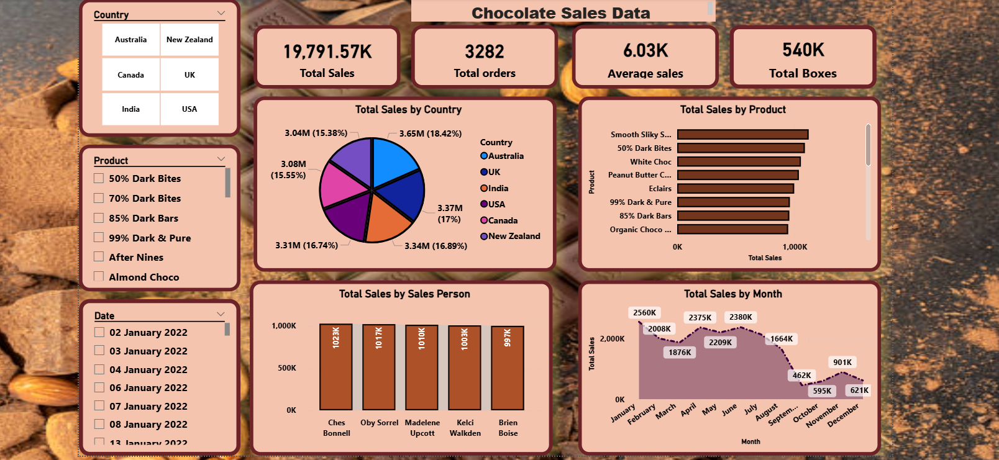

🍫 Chocolate Sales Dashboard – Power BI Project

 📊 Project Overview
This project is a Chocolate Sales Dashboard created using Power BI.
The dashboard provides insights into sales performance, profit analysis,
top products, and regional performance.

 🛠 Tools Used
- Power BI
- Excel / CSV Dataset

 📈 Key Insights
- Total Sales Analysis
- Total Profit Analysis
- Top 5 Products by Sales
- Region-wise Sales Performance
- Monthly Sales Trend
- KPI Cards (Sales, Profit, Quantity)

🎯 Objectives
- To analyze overall chocolate sales performance
- To identify top-performing products
- To compare sales across different regions
- To support data-driven decision-making

 📂 Files Included
- Chocolate_sales_project.pbix
- Chocolate_sales.csv
- Dashboard Screenshot

 📷 Dashboard Preview

